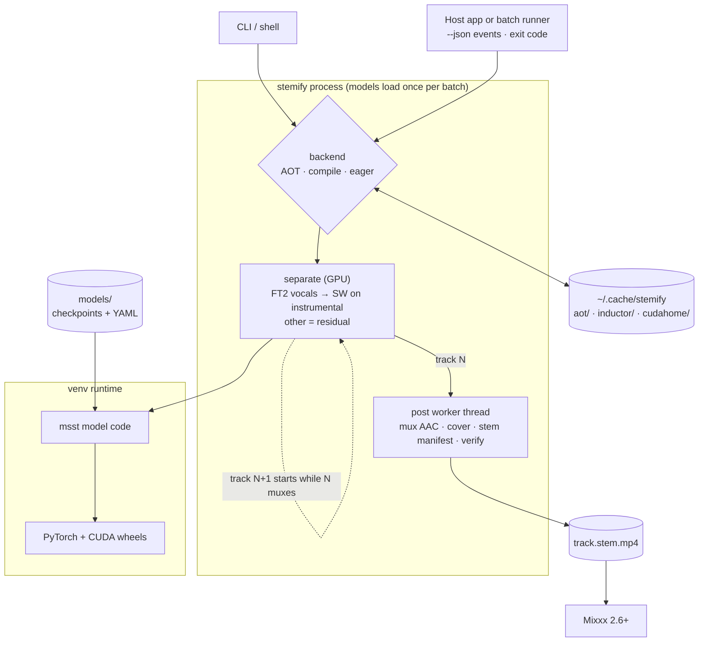

# stemify

**Turn any track into a DJ stem file.** stemify separates music into drums,
bass, melody and vocals with current open-source AI models and packages the
result as a Native Instruments Stems file (`.stem.mp4`) that
[Mixxx](https://mixxx.org) 2.6+ can play with a fader per part.

```bash
stemify ~/Music/*.flac -o ~/Music/stems
```

*Keywords: stem separation, source separation, acapella, instrumental, vocal
remover, Mixxx stems, NI Stems, `.stem.mp4`, BS-RoFormer, Mel-RoFormer, DJ.*

---

## What are stems?

A finished song is one stereo mix: drums, bass, chords, synths and vocals are
summed together and can no longer be adjusted individually. **Stems** are that
same song split back into a handful of parts that play in sync. The common
4-stem layout used by DJ software is:

| Stem | Contains |
|---|---|
| Drums | kick, snare, hats, percussion |
| Bass | bassline, sub |
| Other (melody) | chords, keys, guitars, synths, pads, FX |
| Vocals | lead and backing vocals |

Played together at unity, the four stems sound like the original track. Turn
one down and that part disappears from the mix.

Studios have always had the multitrack parts, but they rarely leave the studio.
Machine-learning **source separation** recovers stems from the finished stereo
file. It is not perfect, but modern models are good enough that a soloed
vocal is usable as an acapella and a muted vocal leaves a clean instrumental.

### The `.stem.mp4` format

Native Instruments' open Stems format is an MP4 container holding five audio
streams: the full mix plus four stems, with a small manifest naming and
colouring each stem. Players that don't understand stems just play the full
mix. Mixxx (2.6+, built with stem support) and Traktor read the format; stemify
targets Mixxx and is untested in Traktor.

## What DJs do with stems

- **Acapella / instrumental on the fly**: kill the vocals of one track and
  bring in the acapella of another for a live mashup.
- **Cleaner transitions**: swap basslines instead of fighting two at once, or
  drop the outgoing track's drums under the incoming one.
- **Vocal clash control**: fade one vocal out while the other comes in,
  without EQ-ing away the whole mid range.
- **Breakdowns and builds**: strip a track to drums only, then bring parts back
  one by one.
- **Effects on one part**: echo-out just the vocal, filter just the melody.
- **Loops and callbacks**: loop a vocal phrase from earlier in the set over the
  current track.

In Mixxx, a stem file adds a volume, mute and effect control per stem on the
deck; controllers can map those to knobs and pads.

## Why render offline

Most DJ apps separate in real time, on the deck, so their models must be small
enough to keep up with playback. Mixxx instead plays pre-rendered stem files,
which means separation can use models that are far heavier and noticeably
cleaner, at the cost of preparing your library ahead of time.

Vocal separation quality on the
[MVSep multisong benchmark](https://mvsep.com/quality_checker/multisong_leaderboard)
(SDR in dB, higher is better; +3 dB halves the error energy):

| Separator | Vocals SDR | Notes |
|---|---|---|
| Serato Stems | 7.2 | real-time |
| Engine DJ (zplane) | 7.1 | offline |
| Traktor Pro 4 | 8.1 | |
| VirtualDJ Stems 2.0 | 8.7 | real-time |
| djay Neural Mix | 8.8 | real-time |
| Demucs `htdemucs_ft` | 8.3 | popular open model |
| **BS-RoFormer SW** | **11.3** | stemify: drums / bass |
| **Mel-RoFormer Kim FT2 bleedless** | **~11.1** | stemify: vocals, lowest bleed |

DJ-app figures are mid-2024 versions submitted by one tester; treat them as
indicative. Differences under ~0.3 dB are rarely audible.

## Architecture



- **Backend select** picks AOT when packages exist or can be built, otherwise
  eager; `--compile` and `--eager` override. See [Backend](#backend-aot-by-default).
- **One process, many tracks**: models load once; each track's mux/tagging runs
  on a worker thread while the GPU separates the next track (at most one track
  queued, so memory stays bounded).
- **Self-contained runtime**: PyTorch and the CUDA headers for AOT builds come
  from pip wheels in the venv; the system only needs the NVIDIA driver and
  ffmpeg.

## Pipeline

```
source ──decode──▶ mix (float32, 44.1 kHz)
                    │
                    ├─▶ Mel-RoFormer FT2 bleedless ─▶ vocals V
                    │
                    └─ mix − V = instrumental I
                                 │
                                 └─▶ BS-RoFormer SW (6-stem) ─▶ drums D, bass B
                                     other = I − D − B

mux: [original mix, D, B, other, V] ─▶ 5 AAC streams + stem manifest + cover art
```

- **Stems sum exactly to the mix.** `other` is the residual, so nothing falls
  between stems, and all faders at unity reproduce the original.
- **Vocals from a dedicated vocal model.** In A/B tests it left less
  instrument bleed in breaks and less low-end thump than taking vocals from the
  6-stem model, which shows as cleaner phrase edges in the waveform.
- **No level games.** Everything stays float end to end and nothing is
  peak-normalised per file, so stem balance is preserved.
- **Chunk overlap matters.** The vocal model runs at 50% overlap
  (`--vocal-overlap 2`): within 32.6 dB of the 87.5% default at under a quarter
  of the time, and free of the 8-second chunk seams that zero overlap leaves.

## Performance

RTX 3060 12 GB, default backend (AOT), both models resident.

**Real-world run:** re-rendering a 351-track DJ library (house, disco, garage,
edits; 2-12 min tracks) as one low-priority background batch:
**7.7x realtime** overall, i.e. an hour of music in under 8 minutes,
zero failures (figures from the first 81 tracks; updated when the run completes).

How we got there, same GPU:

| Pipeline | Vocals SDR | Speed | 4-min track |
|---|---|---|---|
| Demucs `htdemucs_ft` via audio-separator (previous default) | 8.3 | 3.2x | ~76 s |
| FT2 vocals + SW, audio-separator, fp32 | ~11.1 | 1.8x | ~130 s |
| + MSST backend: in-memory, fp16 | ~11.1 | 3.6x | ~67 s |
| + mux/tagging overlapped with the next track's separation | ~11.1 | 4.0x | ~60 s |
| + AOT-compiled transformer core (**default**) | ~11.1 | **6.9x** | ~35 s |
| Real-world library batch (long tracks amortise per-track costs) | ~11.1 | **7.7x** | |

Rows 1-2: real batches (148 and 6 tracks). Rows 3-5: the same 4 tracks
(15.6 min) in one process, excluding startup. Last row: whole batch including
startup, under a low-priority systemd fence. Every step from row 3 on was
checked against the previous output (identical hashes, or below -53 dB for
the compiled paths). Details in [docs/profile-baseline.md](docs/profile-baseline.md).

| | |
|---|---|
| Startup | ~11 s with AOT packages built (one-off build ~3 min) |
| VRAM | ~6 GB peak |
| Output size | ~40 MB per 4-minute track at 256 kbps (five streams) |

## Requirements

- Linux with an NVIDIA GPU (CUDA 12.8 via the PyTorch wheels). Other devices
  are untested.
- Python 3.12
- `ffmpeg` / `ffprobe` with the native AAC encoder
- A Mixxx 2.6+ build with stem support (`STEM` enabled; some distro packages
  ship without it)

## Install

```bash
git clone https://github.com/odtgit/stemify && cd stemify
uv venv -p 3.12 .venv
uv pip install --python .venv/bin/python -r requirements.txt
```

`requirements.txt` includes three `nvidia-cuda-*-cu12` wheels pinned to the CUDA
12.8 build torch ships with. They are only the build-time toolkit for the default
AOT backend (below); no system CUDA toolkit is needed or wanted (a newer one
would mismatch torch's CUDA).

### Backend: AOT by default

With no flag, stemify uses an AOTInductor package of each model's transformer
core. The first run on a given torch/GPU/checkpoint builds it (about 3 min for
both models, 178 s measured, once), every later run just loads it
(~11 s startup against eager's ~4.5 s, passes ~1.8x faster than eager). Selection:

1. a matching package exists in the cache: use it
2. else, if a CUDA toolkit is available (`CUDA_HOME`, or assembled automatically
   from the venv's `nvidia-cuda-*` wheels): build it, then use it
3. else run eager and print a one-line notice on **stderr** (also with
   `--json`, whose stdout stays pure events) saying how to install the wheels.
   A failed build also falls back to eager with a notice.

`--aot` forces AOT and errors instead of falling back, `--eager` forces plain
eager, `--compile` uses `torch.compile` (long warm-up, rarely worth it for
single tracks). `--fp32` implies eager. Cache under
`${XDG_CACHE_HOME:-~/.cache}/stemify/`: `aot/` (~1.6 GB), `inductor/` and
`triton/` (~1.6 GB, build intermediates, safe to delete after the build),
`cudahome/` (a few hundred symlinks into the venv, rebuilt automatically).
Set `CUDA_HOME` yourself to use another toolkit; it must match torch's CUDA.

### Models

Models are not downloaded automatically. Place these four files in `models/`
(or point `STEMIFY_MODEL_DIR` at a directory holding them). They are mirrored
in the [python-audio-separator](https://github.com/nomadkaraoke/python-audio-separator)
model release:

```bash
base=https://github.com/nomadkaraoke/python-audio-separator/releases/download/model-configs
mkdir -p models && cd models
for f in mel_band_roformer_kim_ft2_bleedless_unwa.ckpt config_mel_band_roformer_kim_ft_unwa.yaml \
         BS-Roformer-SW.ckpt BS-Roformer-SW.yaml; do curl -LO "$base/$f"; done
sha256sum -c <<'EOF'
3c450bd66a98b49dd03231fc5ebb84121eef8418236b179423c2b171d62b04d9  mel_band_roformer_kim_ft2_bleedless_unwa.ckpt
c910a0b1493fd3f9cee7a576a7498e44e660510dcaaf5d0d50d5363dde1d0010  config_mel_band_roformer_kim_ft_unwa.yaml
24e7d35ee9c64415673d3fd33e06a67cac2c103c5df6267ba1576459c775916e  BS-Roformer-SW.ckpt
b558996f1e25eb48798bd6502505a5de94c4f966d6edfb1a0420f06cc40b501a  BS-Roformer-SW.yaml
EOF
```

About 1.6 GB in total. **Licensing note:** the provenance of the BS-RoFormer SW
weights is unclear (they are widely reported to originate from a commercial
DAW). This repository does not include or redistribute any model weights;
check the terms yourself before using them beyond personal use.

## Usage

```bash
stemify track.flac -o ~/Music/stems           # one track
stemify ~/Music/dj/*.flac -o ~/Music/stems    # batch; models load once
stemify --force track.flac -o out             # re-render an existing stem file
stemify --keep-stems track.flac -o out        # also keep the float stem wavs
stemify --art-only *.flac -o ~/Music/stems    # refresh cover art, no re-render
```

Existing outputs are skipped unless `--force` is given, so re-running over a
folder only renders new arrivals. Output is `<output-dir>/<source name>.stem.mp4`,
written only on success. Any format ffmpeg decodes works as input; tags are
carried over, and embedded cover art from FLAC and MP3 sources.

| Option | Default | |
|---|---|---|
| `-o, --output-dir` | cwd | |
| `-b, --bitrate` | `256k` | AAC bitrate per stream |
| `--vocal-overlap` | `2` | chunk overlap count for the vocal model |
| `--keep-stems` | off | keep `drums/bass/other/vocals` wavs next to the output |
| `--force` | off | re-render existing outputs |
| `--art-only` | off | copy embedded art from the source into existing outputs |
| `--json` | off | machine-readable progress (below) |
| `--profile` | off | per-stage timing, stem hashes (adds `profile` to `--json`; see Profiling) |
| `--fp32` | off | disable autocast, for precision comparison only; implies `--eager` |
| `--eager` | off | plain eager PyTorch (no AOT package, no compile) |
| `--aot` | on if possible | AOTInductor package of each model's transformer core (STFT/iSTFT stay eager), the default backend (see Backend). Flag forces it and errors if the package cannot be built or loaded. Passes ~5% faster than `--compile`, worst stem difference vs eager -53.6 dB, VRAM +1.1 GB |
| `--compile` | off | `torch.compile` both models: ~1.75x faster passes after a one-off warm-up (225 s cold, ~70 s with a warm inductor cache); stems differ from eager by -53 to -75 dB. Pays off from ~10 tracks per invocation (~3 with a warm cache). The inductor/triton caches persist in `${XDG_CACHE_HOME:-~/.cache}/stemify/{inductor,triton}` (~320 MB for `--compile`), so only the first run after a model or torch change is cold; `TORCHINDUCTOR_CACHE_DIR`/`TRITON_CACHE_DIR` override |
| `--compile-mode` | `default` | `reduce-overhead` or `max-autotune`; max-autotune warms up for 425 s to gain 6% |

### In Mixxx

Add the output folder to your library. If you re-render a track that is
already imported, use *Metadata → Import From File Tags*; Mixxx does not re-read
changed files on its own.

### Which tracks to render

Stems pay off most on tracks with vocals or a clear split between parts.
Instrumentals and minimal tracks gain little: the vocal stem would be near
silent and drums/bass are often already easy to EQ.

### Quality line

Each track reports `other-extra`: how much of the residual `other` stem the
6-stem model did not itself classify as other/guitar/piano. In practice that is
mostly voice the vocal model missed. Around -28 dB is clean; rap and
vocal-sample-heavy tracks can land near -8 dB, meaning some voice remains in
`other`.

## Calling from other programs

stemify is designed to be run as a worker process by a host application:

- **Exit code**: `0` all renders succeeded, `1` at least one failed. A missing
  input path is reported on stderr and skipped without affecting the exit code.
- **Idempotent**: queued tracks that already have an output are skipped.
- **Batch**: pass many tracks to one invocation; the model load is paid once.
- **Overlap**: the next track is separated while the previous one is muxed
  and finalised (one background worker, one track pending). `track_start` for
  track N+1 can therefore precede `track_done` for N; both stay in track order.
- **`--json`**: one JSON object per stdout line; human-readable output is
  suppressed. Backend notices (AOT unavailable, eager fallback) go to stderr.

```json
{"event": "start", "n": 2}
{"event": "track_start", "i": 1, "src": "/music/a.flac"}
{"event": "track_done", "i": 1, "src": "/music/a.flac", "dest": "/stems/a.stem.mp4",
 "secs": 71.3, "audio_secs": 241.0, "other_extra_db": -21.2, "warnings": []}
{"event": "track_failed", "i": 2, "src": "/music/b.flac", "error": "..."}
{"event": "done", "ok": 1, "failed": 1}
```

Sandboxed apps (e.g. a Flatpak Mixxx) should run stemify on the host, via
`flatpak-spawn --host` or a host-side job queue, rather than bundling a CUDA
PyTorch stack.

For background batches on a machine that is also playing audio, keep the render
from starving the audio app's threads, e.g. with systemd:

```bash
systemd-run --user --collect -p CPUWeight=20 -p Nice=19 -p IOSchedulingClass=idle \
  -E OMP_NUM_THREADS=4 systemd-inhibit --what=sleep \
  .venv/bin/python stemify -o ~/Music/stems ~/Music/dj/*.flac
```

GPU contention with waveform rendering has no equivalent knob on consumer
NVIDIA cards; avoid rendering during a live set.

Open items for a host-app background queue: [docs/integration-notes.md](docs/integration-notes.md).

### Profiling

```bash
./profile_run.sh [--fence] [--fp32] [-o OUTDIR] track.flac ...
```

Renders into a scratch dir with `--json --profile --force` while sampling the
GPU every 100 ms, then prints per-stage wall time, GPU utilisation, CPU cores
and a wall-vs-minutes fit (`profile_summary.py`). `--fence` runs under the same
systemd limits as the background batch example above. `done` carries
`batch_wall` under `--profile`. Pass several run dirs to `profile_summary.py` to
compare stem hashes between runs. Baseline: [docs/profile-baseline.md](docs/profile-baseline.md).

## Output format

- Five AAC streams with identical codec and sample rate: the untouched original
  mix as stream 0, then drums, bass, other, vocals, the order Mixxx expects.
- The NI stem manifest (labels and colours) as a `moov.udta.stem` atom. It is
  appended after muxing, which is safe only because ffmpeg writes `moov` after
  `mdat`; stemify refuses to inject otherwise rather than invalidate chunk
  offsets.
- Tags as plain iTunes `ilst` atoms (TagLib does not read QuickTime `mdta`
  keys), with cover art copied from the source into `covr` (ffmpeg would add it
  as a sixth stream, which Mixxx rejects).

## How the models were chosen

Ten candidate models were rendered on the same track, built into full stem
files for A/B listening on the deck, and scored without a reference acapella:
agreement with the other models, bleed during vocal-free passages, and energy
below 120 Hz / above 12 kHz in the vocal stem. Several popular vocal models
turned out to be fine-tunes of the same Kim Mel-RoFormer and were
indistinguishable by ear; FT2 bleedless had the least bleed of that family.
Chunk overlap was then benchmarked separately (see Pipeline).

## Limitations

- Separation is lossy. Reverb tails and heavily processed material smear
  between stems; check a track before playing it out.
- Vocal-like samples, scratches and ad-libs may land in either `vocals` or
  `other`.
- Input is resampled to 44.1 kHz for separation; stream 0 keeps the original.

## Credits

- [ZFTurbo / Music-Source-Separation-Training](https://github.com/ZFTurbo/Music-Source-Separation-Training) (`msst`): inference backend
- Kimberley Jensen (Mel-Band RoFormer vocals) and unwa (FT2 bleedless fine-tune)
- BS-RoFormer SW 6-stem model, as distributed by the separation community
- [python-audio-separator](https://github.com/nomadkaraoke/python-audio-separator): model mirror
- [MVSep](https://mvsep.com): public benchmarks
- [Native Instruments Stems](https://www.native-instruments.com/en/specials/stems/): file format
- [Mixxx](https://mixxx.org): stem playback

## License

MIT for the code in this repository. Model weights are not included and
carry their own terms.
